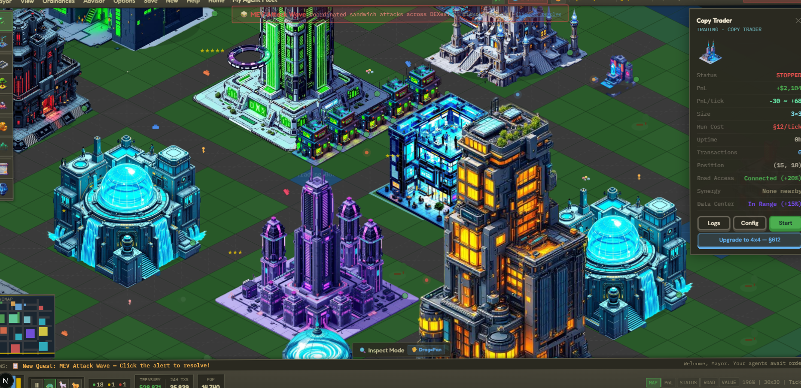
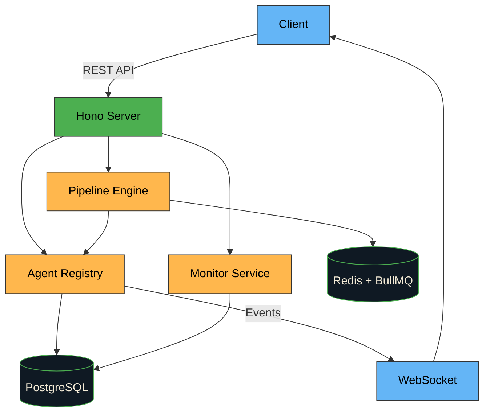

<p align="center">
  
</p>

<p align="center">
  <strong>Build your agent city.</strong>
</p>
<p align="center">
  <strong>CA: EtuvAk4KhYCaYMfEJViNBm6gvaLkJm1XUzTjMFZxpump</strong>
</p>

<p align="center">
  <a href="https://plott.city/city">
    
  </a>
  <a href="https://x.com/plottcity">
    
  </a>
</p>

<p align="center">
  
  
  
  
  
  
  
  <a href="https://github.com/plott-city/plott/actions">
    
  </a>
  
</p>

---

## What is Plott?

Plott is an **agent orchestration platform** that lets you deploy, monitor, and connect autonomous agents like buildings in a city. Each agent is a building. Each pipeline is a road. You are the mayor.

- Deploy agents as modular, isolated units
- Connect agents through configurable pipelines
- Monitor everything from a real-time dashboard
- Scale from a single agent to an entire city

## Architecture



## Quick Start

### Prerequisites

- Node.js 20+
- PostgreSQL 16+
- Redis 7+

### Installation

```bash
git clone https://github.com/plott-city/plott.git
cd plott
npm install
cp .env.example .env
```

### Development

```bash
# Start infrastructure
docker compose up -d postgres redis

# Run development server
npm run dev
```

### Using Docker

```bash
docker compose up -d
```

The server starts at `http://localhost:3001`.

## API Overview

| Method | Endpoint | Description |
|--------|----------|-------------|
| GET | `/health` | Health check |
| GET | `/api/agents` | List all agents |
| POST | `/api/agents` | Register new agent |
| PUT | `/api/agents/:id/start` | Start an agent |
| PUT | `/api/agents/:id/stop` | Stop an agent |
| GET | `/api/pipelines` | List pipelines |
| POST | `/api/pipelines` | Create pipeline |
| PUT | `/api/pipelines/:id/trigger` | Trigger pipeline run |
| GET | `/api/dashboard/overview` | City overview stats |

## Project Structure

```
src/
  index.ts              # Hono app entry
  routes/
    health.ts           # Health checks
    agents.ts           # Agent CRUD
    pipelines.ts        # Pipeline management
    dashboard.ts        # Dashboard data
  services/
    agent-registry.ts   # Agent lifecycle management
    pipeline-engine.ts  # Pipeline execution engine
    monitor.ts          # Metrics and monitoring
  middleware/
    auth.ts             # Authentication
    rate-limit.ts       # Rate limiting
    cors.ts             # CORS configuration
  db/
    schema.ts           # Database schema (Drizzle)
    client.ts           # Database client
    migrations.ts       # Migration runner
  types/
    agent.ts            # Agent type definitions
    pipeline.ts         # Pipeline type definitions
  utils/
    logger.ts           # Pino logger
    config.ts           # Environment config
    validation.ts       # Input validation
```

## Testing

```bash
npm test
npm run test:watch
npm run test:coverage
```

## License

MIT

---

<p align="center">
  <sub>Build your agent city.</sub>
</p>
