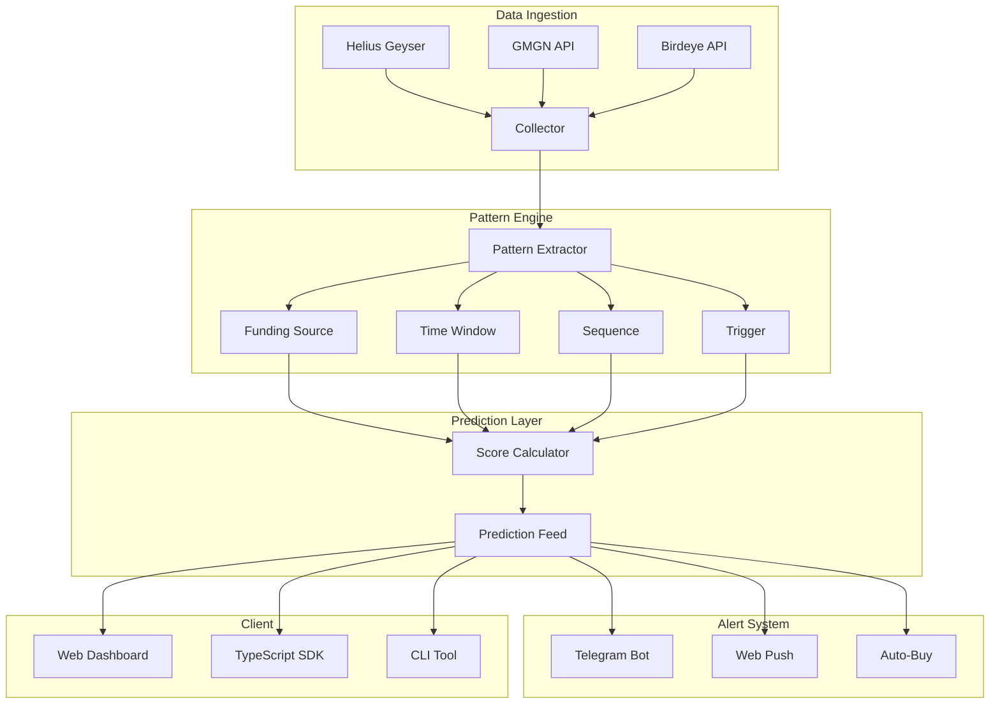

<div align="center">


# STALKR

### Predict the whale.

*GMGN tells you what the whale did. Stalkr tells you what it will do next.*

<a href="https://stalkr-web.vercel.app">
  
</a>
&nbsp;
<a href="https://x.com/stalkr">
  
</a>

</div>

---

## The Problem

Every degen on Solana tracks whale wallets. But every tool tells you what already happened.

| Metric | Reality |
|--------|---------|
| Copy trade loss rate | 60% of copy trades lose money due to delay |
| Average slippage | 15-40% after whale alerts fire |
| Annual opportunity cost | $500M+ from late entries across Solana |

You react. Whales predict. That is the gap.

## Architecture



## The Solution

Stalkr learns whale behavior patterns and predicts their next move before it happens.

### 4-Pattern Analysis Engine

| Pattern | Description |
|---------|-------------|
| **Funding Source** | CEX withdrawal detected. Timer starts. Average delay to first buy calculated from 90-day history. |
| **Time Window** | Active hours identified from UTC histogram. Peak trading windows mapped across 24h cycle. |
| **Sequence** | Token A bought. Conditional probability of Token B computed from historical pair frequency. |
| **Trigger** | Volume spike + price dip conditions evaluated. Buy probability scored against threshold. |

### How It Works

1. **Observe** -- Track whale wallets via Helius Geyser webhooks in real time
2. **Learn** -- Extract 4 behavioral patterns from 90-day transaction history
3. **Predict** -- Cross-match active patterns to generate weighted confidence scores
4. **Alert** -- Send predictions before the whale executes

## Features

| Feature | Description |
|---------|-------------|
| Prediction Feed | Top 10 whales about to move, ranked by confidence score |
| Pattern Analysis | 4-pattern breakdown per whale with time heatmap, CEX delay, sequence pairs, trigger conditions |
| Whale Tiers | Dolphin ($1M+) / Humpback ($10M+) / Blue Whale ($100M+) classification |
| Telegram Alerts | Real-time notifications for high-confidence predictions (70%+ threshold) |
| Watchlist | Track up to 10 whale wallets with personalized prediction alerts |

## Token Utility ($STALKR)

| Mechanism | Detail |
|-----------|--------|
| Buyback & Burn | 50% of prediction fees directed to buyback and burn |
| Tier System | Drifter / Angler / Navigator / Harpooner / Leviathan |
| Access Levels | Higher tiers unlock more predictions, real-time alerts, and auto-buy |

## Installation

```bash
git clone https://github.com/stalkr-labs/stalkr.git
cd stalkr

# Build core
cargo build --release

# Install SDK dependencies
cd sdk && npm install && cd ..
```

## Usage

```bash
# Track a whale wallet
cargo run --bin stalkr-cli -- track <WALLET_ADDRESS>

# Get prediction feed
cargo run --bin stalkr-cli -- predictions --top 10

# Analyze patterns for a specific wallet
cargo run --bin stalkr-cli -- analyze <WALLET_ADDRESS>
```

## Tech Stack

| Layer | Technology |
|-------|------------|
| Core Engine | Rust (pattern analysis, scoring) |
| SDK | TypeScript (client library) |
| Frontend | Next.js 15 + Three.js/R3F (ocean 3D scene) |
| Backend | Hono (TypeScript, edge-ready) |
| Data Sources | Helius Geyser + GMGN + Birdeye |
| Infrastructure | Vercel + Railway |

## Links

- [Website](https://stalkr-web.vercel.app)
- [Documentation](./docs/)
- [Architecture](./docs/architecture.md)
- [API Reference](./docs/api-reference.md)
- [Pattern Analysis](./docs/patterns.md)

---

<div align="center">

*The ocean remembers every pattern.*

**$STALKR**

</div>

<!-- updated -->

<!-- updated -->

<!-- updated -->
