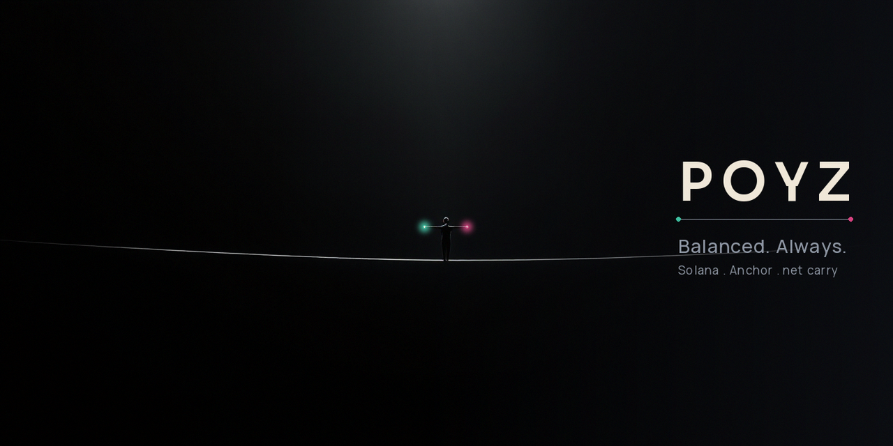
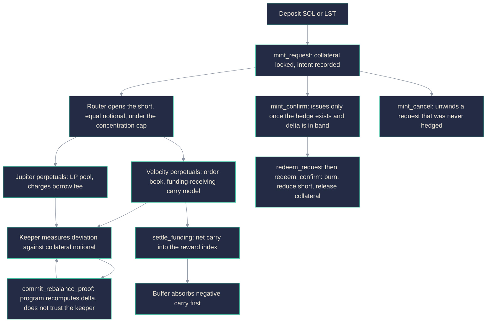

<p align="center">
  
</p>

<p align="center">
  <a href="https://poyz.fi"></a>
  <a href="https://x.com/poyzfi"></a>
  <a href="https://github.com/poyzfi/poyz-sdk"></a>
</p>

<p align="center">
  
  
  
  
</p>

<p align="center">
  
  
  
  
</p>

# Poyz

A delta-neutral synthetic dollar on Solana. SOL and liquid-staking-token collateral is
offset by an equal-notional perpetual short, the funding paid to that short is the yield,
and a bonded keeper resizes the hedge whenever the two legs drift apart.

Balanced. Always.

## How it works

Collateral goes in, a matching short goes on, and the dollar is minted against the pair
rather than against either leg. A keeper measures the deviation between the two, corrects
it when it leaves the band, and commits the execution to the program so the correction is a
record rather than a claim.


```mermaid
%%{init: {'theme': 'base', 'themeVariables': {
  'primaryColor': '#232B45',
  'primaryTextColor': '#EFE7D8',
  'primaryBorderColor': '#3FBFA0',
  'lineColor': '#8E96A3',
  'secondaryColor': '#8A6A3B',
  'tertiaryColor': '#0D0F14',
  'fontFamily': 'monospace'
}}}%%
flowchart TB
  D["Deposit SOL or LST"] --> MR["mint_request: collateral locked, intent recorded"]
  MR --> R["Router opens the short, equal notional, under the concentration cap"]
  R --> VEL["Velocity perpetuals: order book, funding-receiving carry model"]
  R --> JUP["Jupiter perpetuals: LP pool, charges borrow fee"]
  MR --> MC["mint_confirm: issues only once the hedge exists and delta is in band"]
  MR --> MX["mint_cancel: unwinds a request that was never hedged"]
  VEL --> K["Keeper measures deviation against collateral notional"]
  JUP --> K
  K --> CP["commit_rebalance_proof: program recomputes delta, does not trust the keeper"]
  CP --> K
  VEL --> SF["settle_funding: net carry into the reward index"]
  SF --> BUF["Buffer absorbs negative carry first"]
  MC --> RR["redeem_request then redeem_confirm: burn, reduce short, release collateral"]
```

The two venues are not symmetric, and the router prices the difference rather than
averaging over it. An order-book venue pays funding to a short when funding is positive; an
LP-pool venue instead charges a borrow fee to any open position, so that leg is a cost by
construction. Velocity is the only funding-receiving leg; Jupiter perpetuals exist for
capacity and redundancy. Splitting notional evenly between the two would quietly invert the
carry, so each adapter reports a signed carry rate and the router weights on it.

Two things about that leg are worth stating plainly rather than burying. Velocity is the
venue formerly known as Drift, which was exploited for roughly 285 million dollars in April
2026 and relaunched under the new name that July; it is in private beta, and its liquidity
is thin. And funding on its SOL perpetual is **negative at the time of writing**, which
means the short is paying rather than being paid. A funding-yield design whose only
yield-bearing venue is currently negative-carry is a design with an open question in it, not
a running business. [docs/risk-spec.md](docs/risk-spec.md) carries the measured figures.

## Features

- **Two-phase issuance.** `mint_request` locks collateral and records the intent, the hedge
  is opened, and `mint_confirm` issues only once the short exists and the book is inside the
  delta band. `mint_cancel` unwinds a request that was never hedged. A single-instruction
  mint would issue dollars against an unhedged position for the length of a transaction,
  and that window is exactly where a synthetic dollar breaks.
- **Execution proofs the program checks.** `commit_rebalance_proof` records venue, notional
  change, price, and the deviation before and after. The program recomputes the delta from
  the reported exposures instead of accepting the keeper's number, which is what makes a
  published deviation checkable rather than merely reported.
- **Bonded keepers.** `keeper_register` and `keeper_bond` put stake behind the role;
  `keeper_slash` takes it back for a late, misreported, or out-of-path execution. Keeping is
  open to anyone willing to post the bond.
- **Asymmetric carry, priced explicitly.** Venue adapters normalise funding-receiving and
  borrow-fee-paying venues into one signed carry rate so the router compares like with like.
- **First-loss buffer.** `buffer_deposit` and `buffer_withdraw` maintain a buffer that
  absorbs negative carry ahead of holders, on published thresholds rather than discretion.
- **Program-owned vaults.** Collateral, bond, funding, and stake vaults are PDAs. The keeper
  is a delegate that can adjust the hedge and can never withdraw.

## Repository layout

```
programs/poyz/src/     Anchor program
  lib.rs               instruction surface
  state.rs             accounts, parameter bounds
  math.rs              fixed-point arithmetic
  oracle.rs            Pyth pull-oracle gating
  errors.rs  events.rs
  instructions/        admin, vaults, keeper, mint, redeem, funding, buffer, proof
idl/poyz.json          generated IDL, the interface the SDK is built from
tests/                 Anchor integration tests
docs/                  protocol specifications and the research record
```

The TypeScript SDK and the command line interface live in
[poyzfi/poyz-sdk](https://github.com/poyzfi/poyz-sdk).

## Quick start

Formatting and the Rust unit tests need only a Rust toolchain. Building the on-chain
artifact additionally needs the Solana toolchain and `anchor-cli` 0.31.x.

```bash
git clone https://github.com/poyzfi/poyz.git
cd poyz

cargo fmt --all --check
cargo test

# on-chain artifact
anchor build
```

## Program interface

The program exposes 30 instructions. The full signatures and account contexts are in
`idl/poyz.json`, which is generated from the source rather than written by hand.

```rust
// programs/poyz/src/lib.rs
pub fn initialize(ctx: Context<Initialize>, params: InitializeParams) -> Result<()>;
pub fn set_params(ctx: Context<AdminOnly>, params: UpdateParams) -> Result<()>;
pub fn set_oracle(ctx: Context<SetOracle>, feed_id: [u8; 32]) -> Result<()>;

pub fn keeper_register(ctx: Context<KeeperRegister>, bond_amount: u64) -> Result<()>;
pub fn keeper_bond(ctx: Context<KeeperBond>, amount: u64) -> Result<()>;
pub fn keeper_slash(
    ctx: Context<KeeperSlash>,
    amount: u64,
    reason_code: u8,
    evidence_hash: [u8; 32],
) -> Result<()>;

pub fn mint_request(
    ctx: Context<MintRequestCtx>,
    nonce: u64,
    collateral_amount: u64,
    min_synthetic_out: u64,
) -> Result<()>;
pub fn mint_confirm(
    ctx: Context<MintConfirmCtx>,
    nonce: u64,
    hedge_proof_hash: [u8; 32],
    venue_id: u8,
    filled_notional: u64,
) -> Result<()>;
pub fn mint_cancel(ctx: Context<MintCancelCtx>, nonce: u64) -> Result<()>;

pub fn commit_rebalance_proof(
    ctx: Context<CommitRebalanceProof>,
    sequence: u64,
    venues_hash: [u8; 32],
    venue_id: u8,
    delta_bps_before: i32,
    delta_bps_after: i32,
    hedged_notional: u64,
    collateral_notional: u64,
) -> Result<()>;
pub fn settle_funding(ctx: Context<SettleFunding>, amount: u64) -> Result<()>;
```

`venues_hash` is the keeper's own commitment to the venue exposures it reported; the
program computes its own chain hash separately, so a keeper-supplied value is a
verification target rather than a trusted input. `mint_confirm` takes the venue and filled notional of the hedge that was actually opened,
so issuance is tied to a specific execution rather than to an assertion that one happened.
Redeem mirrors mint (`redeem_request`, `redeem_confirm`, `redeem_cancel`). The remaining
instructions cover authority transfer, vault initialisation, unbonding, staking, and the
buffer.

## Parameter bounds

Configuration is set through `initialize` and `set_params`, and the program refuses values
outside these bounds. The constants are in `programs/poyz/src/state.rs`, so the number in
this table can be checked against the code rather than against a blog post.

| Field | Bound | Constant |
| --- | --- | --- |
| `delta_band_bps` | greater than 0, at most 2000 | `MAX_DELTA_BAND_BPS` |
| `delta_exit_bps`, `delta_hard_bps` | ordered `exit <= band <= hard` | checked in `set_params` |
| `collateral_ratio_bps` | 10000 to 50000 | `MIN_/MAX_COLLATERAL_RATIO_BPS` |
| `mint_fee_bps`, `redeem_fee_bps` | at most 500 | `MAX_FEE_BPS` |
| `buffer_share_bps`, `buffer_max_draw_bps` | at most 10000 | checked in `set_params` |
| `max_supply_vs_capacity_bps` | greater than 0, at most 10000 | checked in `set_params` |
| `max_price_age_sec` | at most 3600 | `MAX_PRICE_AGE_SEC_LIMIT` |

The three-band scheme is on-chain, not advisory. `delta_exit_bps` is the inner band a
routine correction pulls the book back to, `delta_band_bps` is the trigger that arms one,
and `delta_hard_bps` is the emergency band. `set_params` enforces the ordering, so a
configuration that would invert the hysteresis dead zone is rejected rather than accepted
and worked around off-chain. The starting values are argued in
[docs/hedge-spec.md](docs/hedge-spec.md) and are to be tuned against measured SOL funding
and volatility before any deployment.

## Deployment status

The program is not deployed. `Anchor.toml` targets `localnet` and `declare_id!` holds the
Anchor placeholder id `Fg6PaFpoGXkYsidMpWTK6W2BeZ7FEfcYkg476zPFsLnS`. A real program id
replaces it at deployment, which requires an explicitly supplied keypair path and cluster.

This project has not been audited. See [SECURITY.md](SECURITY.md).

## Failure modes

This is a hedged instrument, and every part of the hedge can fail. The arithmetic behind
each case, with sources, is in [docs/risk-spec.md](docs/risk-spec.md).

- **Negative funding.** The short pays instead of receiving and the yield becomes a cost.
  Bitcoin funding stayed negative for roughly 46 to 50 days after the November 2022 FTX
  collapse, so the buffer is sized in days of carry against a measured precedent.
- **Auto-deleveraging.** A venue can force-close profitable opposing positions to cover
  bankrupt ones. The short is most profitable during exactly the crash where it is most
  needed, which is the clearest reason the hedge is not welded to a single venue.
- **Venue insolvency.** Margin posted at a failed venue may not be recoverable. Two Solana
  perpetual venues stopped operating in 2025, so this is realised rather than hypothetical.
- **Liquidation of the short.** A fast rally can exhaust margin before a correction lands.
  Hedge leverage stays low and the keeper tops up ahead of the threshold.
- **Collateral tracking.** A liquid-staking token can trade below the asset the perpetual
  tracks, which breaks the hedge ratio quietly. Collateral is valued on its own feed.
- **Correlated tail.** These arrive together rather than independently.

The yield is variable, it can be negative, and it is neither promised nor insured. Any
figure published without a reproducible measurement behind it is labelled an estimate.

## Documentation

| Document | Contents |
| --- | --- |
| [docs/architecture.md](docs/architecture.md) | System design, account model, oracle gating |
| [docs/hedge-spec.md](docs/hedge-spec.md) | Delta math, band control, routing, on-venue call sequence |
| [docs/risk-spec.md](docs/risk-spec.md) | Failure modes with worked arithmetic and sources |
| [docs/security.md](docs/security.md) | Authority model, upgrade path, invariants |
| [docs/research-notes.md](docs/research-notes.md) | Every external claim cited above, with its source |

## Contributing

Issues and pull requests are welcome. Changes to band parameters, routing weights, or
buffer thresholds should come with the arithmetic, in the style of `docs/hedge-spec.md`.
See [CONTRIBUTING.md](CONTRIBUTING.md).

Commit messages are plain sentences; colon prefixes such as `feat:` are rejected by CI.

```bash
./scripts/check-commit-messages.sh --message "your subject line here"
```

## References

- [Velocity funding rates](https://docs.velocity.exchange/trading/funding-rates)
- [Velocity liquidation engine](https://docs.velocity.exchange/protocol/trading/liquidations/liquidation-engine)
- [Velocity insurance fund](https://docs.velocity.exchange/insurance-fund/insurance-fund-intro)
- [Pyth price feeds](https://docs.pyth.network/price-feeds)
- [Anchor framework](https://www.anchor-lang.com/)

## License

MIT. See [LICENSE](LICENSE).
