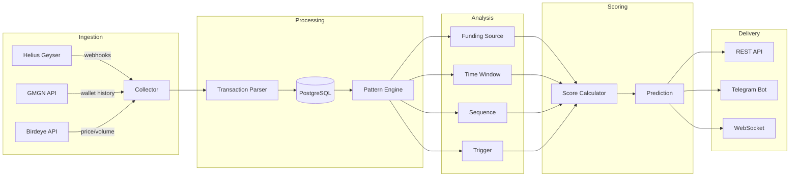

# Architecture

## System Overview

Stalkr is a predictive wallet intelligence platform that analyzes whale behavior on Solana to predict their next moves. The system comprises four main layers: data ingestion, pattern analysis, prediction scoring, and alert delivery.

## Data Flow

## Components

### Data Ingestion Layer

| Component | Source | Purpose |
|-----------|--------|---------|
| Helius Geyser | Solana RPC | Real-time transaction webhooks for tracked wallets |
| GMGN API | GMGN | Wallet labels, historical trading data, smart money classification |
| Birdeye API | Birdeye | Token prices, volume data, market metrics |
| CEX Address DB | Internal | Known centralized exchange hot wallet addresses |

### Pattern Engine

The core analysis engine extracts four behavioral patterns from 90-day transaction history. Each pattern produces a normalized score that feeds into the prediction model. See [patterns.md](./patterns.md) for detailed documentation.

### Prediction Scoring

The scoring layer combines pattern signals using weighted aggregation:

| Pattern | Weight |
|---------|--------|
| Funding Source | 0.30 |
| Time Window | 0.25 |
| Sequence | 0.25 |
| Trigger | 0.20 |

A prediction is generated when the combined confidence score exceeds the threshold (default: 70%). The prediction includes a time window estimate inversely correlated with confidence.

### Alert System

| Channel | Trigger | Latency |
|---------|---------|---------|
| Web Dashboard | All predictions | Real-time (WebSocket) |
| Telegram Bot | High confidence (70%+) | Under 30 seconds |
| REST API | On request | Standard HTTP |

## Infrastructure

| Service | Platform | Purpose |
|---------|----------|---------|
| Frontend | Vercel | Next.js 15 web application with Three.js ocean scene |
| Backend API | Railway | Hono TypeScript API server |
| Database | Railway (addon) | PostgreSQL for persistent storage |
| Cache | Railway (addon) | Redis for prediction caching and rate limiting |
| Queue | BullMQ | Background job processing for pattern extraction |

## On-chain Program

The Solana program (Anchor framework) provides on-chain prediction records for transparency and token utility integration. It manages tracker state, whale registration, prediction recording, and resolution tracking.

## Whale Tier Classification

| Tier | Portfolio Value | Access Level |
|------|----------------|-------------|
| Dolphin | $1M - $10M | Standard predictions |
| Humpback | $10M - $100M | Enhanced analysis |
| Blue Whale | $100M+ | Full pattern suite |

<!-- updated -->

<!-- updated -->
