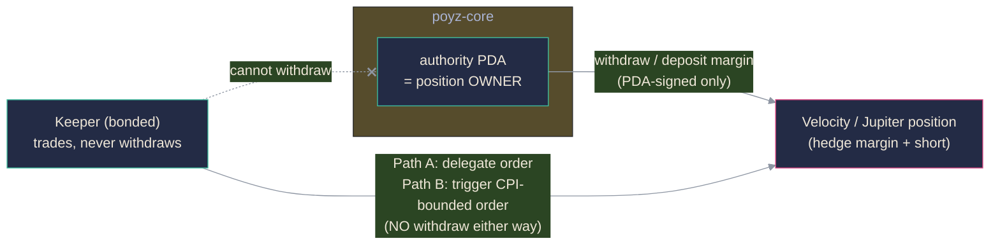
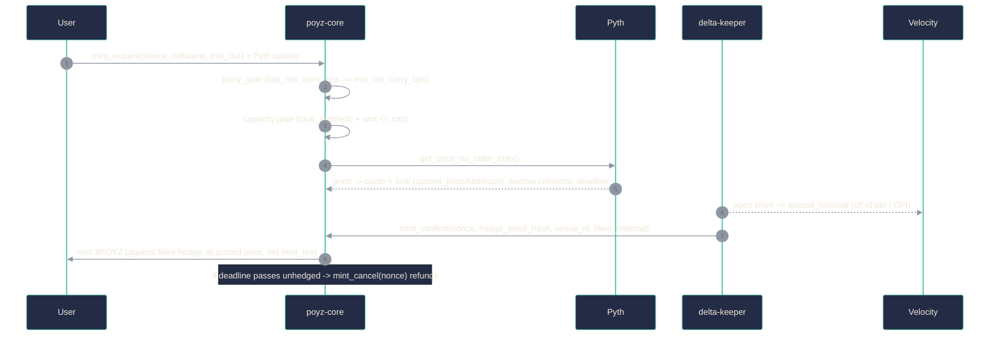

# POYZ Architecture

**Poyz ($POYZ)** is a Solana-native delta-neutral synthetic dollar. A depositor posts SOL or a
liquid-staking token (LST); the protocol opens an equal-notional perpetual short on-chain so the
combined position holds close to zero directional exposure, and mints $POYZ against the dollar value
of the collateral. A Delta Keeper watches net exposure and rebalances when it moves past a band,
committing a verifiable proof on-chain each time. Carry paid to/charged on the short accrues to a
funding vault distributed to staked $POYZ; a risk buffer absorbs first losses.

Two realities, verified on-chain and via live APIs (`research-notes.md` 0-2), shape the design:
the hedge venue is **Velocity (formerly Drift)**, which was exploited for ~$285M in 2026-04 and is
relaunching in private beta; and **carry is negative today** (SOL-PERP 1y -35.8% APR). So the
protocol does not assume a working yield -- it **gates minting on carry and hedge capacity in
code**.

> This document is reconciled against the actual compiled program IDL,
> `packages/anchor-program/target/idl/poyz.json` (30 instructions), which is the source of truth
> for instruction/account names. Where `_DIRECTION.md` 8-1 and the IDL disagree on a name, the IDL
> wins and the conflict is flagged (section 12). `[VERIFY]`/`[BLOCKED]` mark items not yet
> confirmable (Velocity is in private beta with offline docs). Citations resolve to
> `research-notes.md`.

---

## 1. Design principles

1. **On-chain hedge custody, off-chain hedge execution.** Collateral and hedge margin are custodied
   by the POYZ program. Perp orders are placed off-chain by keepers who can trade but never
   withdraw -- on Velocity via a no-withdraw delegate if that feature survived the rebrand
   (`[BLOCKED]`, Path A), otherwise via a program-CPI-enforced path (Path B, section 4).
2. **Hedge-first mint, attest, don't trust.** Minting is two-step: `mint_request` escrows collateral
   and locks a quoted price; `mint_confirm` mints only after the keeper has actually placed the hedge
   (`filled_notional`). Rebalances are re-verified by the program from live accounts and recorded as
   a hash-chained `RebalanceProof`; a proof for an out-of-band book cannot be committed (section 8).
3. **Separate the token from the venue.** $POYZ is the asset. Velocity (`venue_id` 0, funding-
   receiving) and Jupiter Perps (`venue_id` 1, borrow-fee-paying) are hedge-execution venues behind
   a venue-adapter abstraction (`hedge-spec.md` 1). POYZ does not build a perpetual exchange. Three
   Solana perp venues died or were breached in ~18 months (`risk-spec.md` 2), so the venue set is
   config, not hard-code.
4. **Mint only when carry supports it and only within hedgeable capacity.** Carry is a signed rate,
   negative today; the buffer is a buffer, not a guarantee. `Config.min_net_carry_bps` gates mint on
   carry (section 9.1) and `Config.max_supply_vs_capacity_bps` + `venue_capacity_notional` gate it on
   hedgeable depth (section 9.2). Nothing claims a guaranteed return.

---

## 2. System overview

```mermaid
%%{init: {'theme':'base','themeVariables':{
  'background':'#0D0F14','primaryColor':'#232B45','primaryTextColor':'#EFE7D8',
  'primaryBorderColor':'#3FBFA0','lineColor':'#8E96A3','secondaryColor':'#232B45',
  'tertiaryColor':'#0D0F14','clusterBkg':'#0D0F14','clusterBorder':'#8E96A3',
  'fontFamily':'Manrope, sans-serif','fontSize':'14px'}}}%%
flowchart TB
    User([User / dApp])
    subgraph ONCHAIN["On-chain -- poyz-core (Anchor 0.31)"]
      direction TB
      MINT["mint_request -> mint_confirm / mint_cancel<br/>redeem_request -> redeem_confirm / redeem_cancel<br/>(carry_gate + capacity gate)"]
      MINTAUTH["$POYZ synthetic mint authority (PDA)"]
      VAULT["Collateral Vault (SOL / LST, PDA-owned)"]
      HEDGEAUTH["authority PDA<br/>(owns venue positions + vaults)"]
      KEEPREG["Keeper registry<br/>keeper_bond / keeper_slash"]
      PROOF["RebalanceProof chain<br/>(commit_rebalance_proof)"]
      FUND["Funding accounting<br/>(settle_funding, acc_funding_per_share)"]
      BUF["Risk Buffer (first-loss)"]
    end
    subgraph OFFCHAIN["Off-chain services (packages/)"]
      direction TB
      KEEPER["delta-keeper (watch delta, trigger)"]
      ROUTER["hedge-router (venue allocation)"]
      INDEXER["indexer / API (apps/service)"]
    end
    subgraph VENUES["Perp hedge venues (external)"]
      direction TB
      VELO["Velocity (formerly Drift), venue_id 0<br/>owner = authority PDA; delegate = keeper [BLOCKED]<br/>PRIMARY: funding-receiving, capacity-limited"]
      JUP["Jupiter Perps, venue_id 1 (LP-pool)<br/>oracle-priced, program-owned<br/>SECONDARY: borrow-fee-paying"]
    end
    PYTH["Pyth pull oracle (PriceUpdateV2)"]

    User -->|mint_request: deposit SOL/LST| MINT
    MINT --> VAULT
    MINT -.reads.-> PYTH
    KEEPER -->|monitor| VELO
    KEEPER -->|monitor| JUP
    KEEPER --> ROUTER
    ROUTER -->|adjust short (delegate / CPI)| VELO
    ROUTER -->|overflow short (pays borrow)| JUP
    KEEPER -->|mint_confirm / commit_rebalance_proof| PROOF
    MINTAUTH -->|mint $POYZ after hedge filled| User
    PROOF -.recompute delta from.-> VAULT
    PROOF -.recompute delta from.-> VELO
    PROOF -.reads.-> PYTH
    HEDGEAUTH -->|PDA-signed margin move| VELO
    VELO -->|funding to short| FUND
    JUP -.borrow-fee cost.-> FUND
    FUND -->|claim_funding: net carry| User
    BUF -.covers first loss.-> FUND
    KEEPREG -.keeper_slash.-> BUF
    INDEXER -.reads chain.-> PROOF
    INDEXER -->|delta / net carry / capacity| User

    classDef long fill:#232B45,stroke:#3FBFA0,color:#EFE7D8;
    classDef short fill:#232B45,stroke:#D6427F,color:#EFE7D8;
    classDef oracle fill:#232B45,stroke:#E5B769,color:#EFE7D8;
    class VAULT,MINTAUTH long;
    class VELO,JUP short;
    class PYTH oracle;
```

---

## 3. On-chain / off-chain responsibility boundary

| Concern | On-chain (`poyz-core`) | Off-chain (`packages/*`) |
|---|---|---|
| Collateral + hedge-margin custody | Yes -- PDA-owned | No |
| $POYZ mint/burn authority | Yes -- PDA | No |
| Placing/adjusting perp orders | No (Path A) / Yes-by-CPI (Path B) | Yes -- keeper as delegate/trigger |
| Venue allocation | No | Yes -- `hedge-router` |
| Delta measurement of record | Yes -- recomputed in `commit_rebalance_proof` | Advisory (triggering only) |
| Delta-band + carry + capacity gates | Yes -- transaction invariants | No |
| Funding accounting / reward index | Yes -- `settle_funding` | Indexed/displayed |
| Keeper bond/slash | Yes | Evidence assembled off-chain, verified on-chain |

Rule: anything protecting user funds is on-chain and trust-minimized; anything deciding timing or
venue is off-chain and replaceable. The keeper can be wrong, slow, or replaced without any user
losing custody -- it can never withdraw and never commit an out-of-band proof.

---

## 4. Trust model: program owns the position, keeper can trade but never withdraw

The pre-rebrand venue (formerly Drift) supported a **delegate** that could place/cancel orders but **could not withdraw**.
Whether **Velocity 0.13.0** (the rebrand of that codebase) retains delegation is `[BLOCKED]` in
private beta, so the keystone ships by whichever path holds:

- **Path A -- no-withdraw delegate (if retained).** The Velocity position is owned by the `authority`
  PDA; only a `poyz-core` PDA-signed CPI can withdraw margin; the keeper is the delegate and can
  open/resize/close but move no funds.
- **Path B -- program-CPI-enforced (if delegation absent).** The keeper only triggers a `poyz-core`
  instruction that CPIs the venue order under the PDA with program-enforced price/size/delta bounds.
  Removes the delegate dependency; also the recommended hardening for scale (`security.md` 2.3).

For **Jupiter** (LP-pool, no order-book delegate) the keeper only triggers a program instruction
that opens/closes the program-owned position. Either way the invariant holds: **a malicious keeper's
worst case is bad hedging, never theft.** Zeta and Mango v4 (both discontinued) are not used.

```mermaid
%%{init: {'theme':'base','themeVariables':{
  'background':'#0D0F14','primaryColor':'#232B45','primaryTextColor':'#EFE7D8',
  'primaryBorderColor':'#3FBFA0','lineColor':'#8E96A3','fontFamily':'Manrope, sans-serif'}}}%%
flowchart LR
    subgraph PROG["poyz-core"]
      PDA["authority PDA<br/>= position OWNER"]
    end
    KEEPER["Keeper (bonded)<br/>trades, never withdraws"]
    SUB["Velocity / Jupiter position<br/>(hedge margin + short)"]
    PDA -- "withdraw / deposit margin<br/>(PDA-signed only)" --> SUB
    KEEPER -- "Path A: delegate order<br/>Path B: trigger CPI-bounded order<br/>(NO withdraw either way)" --> SUB
    KEEPER -. "cannot withdraw" .-x PDA
    classDef short fill:#232B45,stroke:#D6427F,color:#EFE7D8;
    class SUB short;
```

`[BLOCKED]` Confirm delegation support + CPI account sets against `@velocity-exchange/sdk` 0.13.0;
ship Path B if unavailable.

---

## 5. On-chain program: accounts, instructions, PDAs (reconciled to the IDL)

Program crate: `packages/anchor-program` (Anchor 0.31, `overflow-checks = true`). $POYZ is an SPL
mint whose authority is a program PDA; collateral uses `token_interface` (SPL + Token-2022). All
integer math; ratios in bps (`anchor-lessons.md`, `solana/SKILL.md`).

### 5.1 Accounts (names + key fields from `poyz.json`)
- **`Config`** (singleton, 60 fields). Authorities: `authority`, `pending_authority`, `guardian`.
  Mints: `synthetic_mint`, `collateral_mint`, `bond_mint` (keepers bond in a dedicated token).
  Oracle: `oracle`, `feed_id`, `max_price_age_sec`, `max_conf_bps`. Accounting: `total_collateral`,
  `pending_collateral`, `total_synthetic`, `pending_redeem_synthetic`, `hedged_notional`,
  `total_staked`, `acc_funding_per_share`, `buffer_balance`, `bonded_total`, `slashed_total`.
  **Control knobs (the gates this doc describes are real Config fields):** `delta_band_bps`,
  `delta_exit_bps`, `delta_hard_bps`; `min_net_carry_bps` + `last_net_carry_bps` (**carry_gate**,
  9.1); `max_synthetic_supply`, `venue_capacity_notional`, `max_supply_vs_capacity_bps`
  (**capacity cap**, 9.2); `collateral_ratio_bps`, `mint_fee_bps`, `redeem_fee_bps`,
  `max_hedge_slippage_bps`, `buffer_share_bps`, `buffer_max_draw_bps`; timing
  `request_ttl_sec`, `min_settlement_delay_sec`, `unbond_cooldown_sec`, `unstake_cooldown_sec`,
  `buffer_unlock_delay_sec`; `negative_funding_since` (drives the playbook, `risk-spec.md` 1.5);
  venue state `last_venue_id`, `venue_flags` (activation bitmask, below), `venue_state_at`,
  `max_venue_state_age_sec`; `mint_paused`, `redeem_paused`; `last_proof_hash`, `rebalance_count`.

  **Venue activation via `venue_flags`, not hard-coding.** `venue_id` validity is enforced with
  `require!`, but which venues are *active* is an admin-toggled bitmask (`Config.venue_flags`; initial
  state Velocity only, `0b0001`). Enabling a new venue -- when one is added or an existing one fails
  -- is a `set_params` config change, **not a program upgrade**. Given three Solana perp venues died
  or were breached in ~18 months (`risk-spec.md` 2), this configurability is a concrete risk-response,
  not premature generality: POYZ can migrate the hedge to a newly-activated venue without redeploying.
- **`MintRequest`** / **`RedeemRequest`** (per pending action): `user`, `nonce`, amount,
  `quoted_notional`/`quoted_collateral`, `min_synthetic_out`/`min_collateral_out`, `quoted_price`,
  `quoted_slot`, `quoted_expo`, `created_at`, `deadline`. The price is quoted and **locked** at
  request time; the request expires at `deadline` (`request_ttl_sec`).
- **`RebalanceProof`** (per proof): see section 8.
- **`Keeper`**: `keeper`, `bonded`, `slashed`, `proofs_committed`, `active`, `registered_at`,
  `last_proof_at/slot`.
- **`StakePosition`**: `owner`, `amount`, `reward_debt`, `unclaimed`, `claimed_total`,
  `cooldown_end`, `pending_unstake`.

### 5.2 Instruction set (30, per the IDL -- grouped)
- **Admin/init:** `initialize(params)`, `set_params(params)`, `set_paused(mint_paused,
  redeem_paused)`, `set_oracle(feed_id)`, `set_guardian(guardian)`, `transfer_authority(new)` +
  `accept_authority()` (2-step), `init_collateral_vault`, `init_bond_vaults`, `init_funding_vaults`,
  `init_stake_vaults`.
- **Mint (2-step, hedge-first):** `mint_request(nonce, collateral_amount, min_synthetic_out)` ->
  `mint_confirm(nonce, hedge_proof_hash, venue_id, filled_notional)` / `mint_cancel(nonce)`.
- **Redeem (2-step):** `redeem_request(nonce, synthetic_amount, min_collateral_out)` ->
  `redeem_confirm(nonce, unwind_proof_hash, venue_id, unwound_notional)` / `redeem_cancel(nonce)`.
- **Keeper:** `keeper_register(bond_amount)`, `keeper_bond(amount)`, `keeper_unbond(amount)`,
  `keeper_slash(amount, reason_code, evidence_hash)`.
- **Proof/funding:** `commit_rebalance_proof(sequence, venues_hash, venue_id, delta_bps_before,
  delta_bps_after, hedged_notional, collateral_notional)`, `settle_funding(amount)` (moves the
  settled amount only -- the carry *rate* is no longer an argument here), `claim_funding()`.
- **Venue state:** `report_venue_state(venue_id, net_carry_bps, capacity_notional)` -- the keeper's
  on-chain report and now the **sole writer of the carry rate**. It updates `Config.last_net_carry_bps`
  (read by `carry_gate`, 9.1) and `Config.venue_capacity_notional` (read by the capacity cap, 9.2),
  stamped with `venue_state_at` and bounded by `max_venue_state_age_sec`. The gates are **fail-closed**:
  if `report_venue_state` was never called the state is missing (`VenueStateMissing`) and `mint` is
  blocked; if it is older than `max_venue_state_age_sec` it is stale (`VenueStateStale`) and `mint` is
  blocked; a future timestamp is rejected (`VenueStateFromFuture`). No fresh venue report, no mint.
- **Staking:** `stake(amount)`, `request_unstake(amount)`, `unstake()`.
- **Buffer:** `buffer_deposit(amount)`, `buffer_withdraw(amount)`.

Placing the perp order itself is not an instruction in Path A (keeper's delegate tx); in Path B it
is folded into a `poyz-core` CPI. Keep every context under the 4096-byte stack limit (`Box<>`, split
`init`); the four `init_*_vaults` instructions already separate vault creation for this reason.

---

## 6. Oracle integration (Pyth pull)

Pyth is a pull oracle: post `PriceUpdateV2` before reading; `get_price_no_older_than(max_price_age_sec)`
reverts on staleness (`research-notes.md` 3). `mint_request`, `redeem_request`, and
`commit_rebalance_proof` take the Pyth account; the price + `quoted_slot`/`quoted_expo` are recorded
so the mint/redeem price is fixed at request time. Confidence gate: reject when `conf/price >
max_conf_bps`. Integer `price*10^expo`, never `f64`. POYZ reads Pyth directly, independent of
Velocity's internal oracle; measured cross-venue agreement was ~1 bp (Pyth $76.285 / Velocity
$76.293 / Jupiter $76.294, `research-notes.md` 3), so this path is not `[BLOCKED]`.

---

## 8. Execution proof: `commit_rebalance_proof`

The proof recomputes everything the program *can* derive, takes a **bonded attestation** for the one
thing it cannot, and wraps both in a hash chain. Args (IDL): `sequence, venues_hash, venue_id,
delta_bps_before, delta_bps_after, hedged_notional, collateral_notional`. Authoritative spec: the top
comment of `packages/anchor-program/programs/poyz/src/instructions/proof.rs`.

**Computed vs accepted -- the crux of "attest, don't trust."** `collateral_notional` and
`delta_bps_after` arrive as keeper args but are **not** stored: the program **recomputes both** from
`Config.total_collateral` valued at the Pyth price posted in the same transaction, enforces the band
on *its* number, and rejects the call if the keeper's claim disagrees (`ProofCollateralMismatch` /
`ProofDeltaMismatch`). The record holds the program's values. **`hedged_notional` remains an
attestation** -- this program cannot read the venue account cross-program, so the short leg is the one
number it must take on trust. That is exactly why it is bonded and slashable, why over-reporting it is
separately capped at fill time (`HedgeFillTooLarge`, 9 / `security.md` 1.1), and why the full venue
payload is hashed for off-chain verification. Everything the program can derive, it derives; the
single trusted input is isolated and defended.

Logic:
1. Recompute `collateral_notional = Config.total_collateral * price * 10^expo` (gated Pyth,
   `OraclePriceStale` on staleness); require the keeper arg matches (`ProofCollateralMismatch`).
2. Take `hedged_notional` as the bonded attestation (not re-derivable on-chain).
3. Recompute `delta_bps_after = (collateral_notional - hedged_notional) * 10000 / collateral_notional`;
   require it equals the keeper arg (`ProofDeltaMismatch`) **and `abs(delta_bps_after) <=
   delta_band_bps`**, else revert -- a proof for an unbalanced book cannot exist. `delta_bps_before`
   is the attested pre-cycle delta (recorded; indexer checks continuity).
4. Require `sequence` gap-free (`ProofSequenceMismatch`), slot monotonic (`ProofSlotNotMonotonic`),
   `venues_hash` non-empty (`EmptyProofHash`); compute the chain link; emit `RebalanceProofCommitted`.

**Two hashes, different trust properties:**
- `venues_hash` is **keeper-supplied**: `sha256` over the Borsh `ExecutionPayload` (config, sequence,
  keeper, venue_id, venue_subaccount, delta_before/after, collateral_notional, hedged_notional, oracle
  fields, and the list of `Fill{order_id, price, base_amount, ts}`). The canonical encoder is in
  `packages/delta-keeper` and `packages/sdk-ts` ships the verifier, so **anyone can re-derive it from
  the actual venue account** and catch a false `hedged_notional` attestation.
- `this_hash` is **program-computed, never supplied**: `sha256(prev_hash || config || sequence ||
  slot || oracle_price || oracle_conf || oracle_expo || oracle_publish_time || collateral_notional ||
  hedged_notional || delta_bps_before || delta_bps_after || venue_id || venues_hash || keeper)`, and
  becomes `Config.last_proof_hash`. Altering any past field changes every subsequent `this_hash`, so
  history cannot be rewritten. The account stores digests only (fixed 232 bytes).

`RebalanceProof` account (19 fields, IDL): `keeper`, `venues_hash`, `prev_hash`, `this_hash`,
`sequence`, `hedged_notional`, `collateral_notional`, `oracle_publish_time`, `oracle_posted_slot`,
`slot`, `timestamp`, `oracle_price`, `oracle_conf`, `delta_bps_before`, `delta_bps_after`,
`oracle_expo`, `venue_id`, `bump`.

Verifiable to anyone: (a) at each `sequence` the net delta was inside the band; (b) the chain is
tamper-evident and gap-free; (c) oracle price/conf/venue and both delta endpoints are recorded. Not
proven: best price / soon enough -- execution-quality faults handled by bond/slash + the published
`delta_bps` time-series (`security.md`). Funding is rolled separately by `settle_funding`
(section 11).

---

## 9. Mint flow (2-step, hedge-first) with carry + capacity gates

```mermaid
%%{init: {'theme':'base','themeVariables':{
  'background':'#0D0F14','primaryColor':'#232B45','primaryTextColor':'#EFE7D8',
  'primaryBorderColor':'#3FBFA0','lineColor':'#8E96A3','actorBkg':'#232B45',
  'actorTextColor':'#EFE7D8','actorBorder':'#3FBFA0','signalColor':'#8E96A3',
  'signalTextColor':'#EFE7D8','noteBkgColor':'#232B45','noteTextColor':'#EFE7D8',
  'fontFamily':'Manrope, sans-serif'}}}%%
sequenceDiagram
    autonumber
    participant U as User
    participant P as poyz-core
    participant O as Pyth
    participant K as delta-keeper
    participant D as Velocity
    U->>P: mint_request(nonce, collateral, min_out) + Pyth update
    P->>P: carry_gate (last_net_carry_bps >= min_net_carry_bps)
    P->>P: capacity gate (total_synthetic + amt <= cap)
    P->>O: get_price_no_older_than()
    O-->>P: price -> quote + lock (quoted_price/slot/expo), escrow collateral, deadline
    K-->>D: open short ~= quoted_notional (off-chain / CPI)
    K->>P: mint_confirm(nonce, hedge_proof_hash, venue_id, filled_notional)
    P->>U: mint $POYZ (against filled hedge, at quoted price, net mint_fee)
    Note over P: if deadline passes unhedged -> mint_cancel(nonce) refunds
```

Because minting completes only at `mint_confirm` -- **after** the hedge is placed (`filled_notional`)
-- there is no transient unhedged-long window, and the price is locked at request time
(`MintRequest.quoted_price`). `mint_cancel` refunds an unconfirmed request past its `deadline`.
`filled_notional` is **bounded on both sides**: too small under-hedges the new supply
(`HedgeFillTooSmall`); too large is the subtler attack -- an over-reported fill inflates
`hedged_notional`, which is the one *attested* (non-recomputable) number in the proof (section 8), so
an inflated fill would let real under-hedge slip past every delta-band check. The upper bound
(`HedgeFillTooLarge`) closes that hole (`security.md` 1.1).

### 9.1 `carry_gate` (`Config.min_net_carry_bps`)
Carry is negative today (`research-notes.md` 2). Minting in a negative-carry regime adds hedge that
bleeds the buffer, so `mint_request` reverts unless `Config.last_net_carry_bps >=
Config.min_net_carry_bps` (where `last_net_carry_bps` is set by the keeper's `report_venue_state`,
5.2, and rejected if older than `max_venue_state_age_sec`). **Deriving the floor from buffer runway:** with buffer ratio `b =
buffer/supply` and runway `= b / |carry_daily|`, requiring `runway >= min_runway_days` gives
`min_net_carry (daily) = -(b / min_runway_days)`. Worked (`b=3%`, 30 days): `~ -36.5%/yr`. Against
measured data, the 1y regime (-35.8%) *just* passes, the 30d (-43.3%) and 24h (-105%) regimes are
**blocked**. As the buffer drains, `b` falls and the floor tightens automatically. `carry_gate`
blocks only new mint; existing supply is managed by the playbook (`risk-spec.md` 1.5). "We don't
print when it doesn't pay" -- enforced in code.

### 9.2 Capacity cap (`max_supply_vs_capacity_bps`, `venue_capacity_notional`)
POYZ can only mint what it can hedge, and Velocity is thin: OI ~$7,646, 24h volume ~$8,118, max
order ~$103K (`research-notes.md` 1.3). `mint_request` reverts unless `total_synthetic + amount <=
min(max_synthetic_supply, venue_capacity_notional * max_supply_vs_capacity_bps / 10000)`. The
capacity is the keeper-reported hedgeable depth across venues (via `report_venue_state`, 5.2),
published (`/hedge/venues`) so the limit is visible, not silent. Concretely, at a 15% in-venue share
of Velocity's ~$7,646 OI, the Velocity leg can hold only ~**$1,147** of hedge (`hedge-spec.md` 4.1);
almost everything must overflow to Jupiter at a borrow cost, or supply stays tiny -- the honest
consequence of the current liquidity reality. **Do not read the aggregate as yield capacity:** the
live backend `venue_capacity_usd` is ~$10.0M, but ~$10M of that is **Jupiter pool liquidity**
(borrow-*cost* capacity) and only ~$7,680 is Velocity's funding-*yield* capacity -- the API's `basis`
field marks that "OI and pool liquidity are different quantities." Summing them makes hedge headroom
look like $10M when the yield-bearing leg is ~4 orders of magnitude smaller. The cap uses the
aggregate for *can-we-hedge-at-all*; the carry math (`hedge-spec.md` 4.2) treats the Jupiter portion
as pure cost.

---

## 10. Redeem flow (2-step)

`redeem_request(nonce, synthetic_amount, min_collateral_out)` burns/escrows $POYZ and quotes+locks
the collateral owed at the oracle price (with `deadline`). The keeper reduces the short by the
matching notional off-chain, then `redeem_confirm(nonce, unwind_proof_hash, venue_id,
unwound_notional)` releases collateral net of `redeem_fee_bps`; `redeem_cancel` reverses an
unconfirmed request past deadline. Large redemptions incur the hedge-unwind slippage quantified in
`risk-spec.md` 4.2 (acute given Velocity's depth); `redeem_fee_bps` + the request/confirm gating damp
redemption-driven imbalance rather than pretending it is free.

---

## 11. Funding settlement and staked $POYZ

`settle_funding(amount)` records the realized carry *amount* and advances
`Config.acc_funding_per_share` by the epoch's **net carry** (the 3-way split `gross_funding -
hedge_cost`, `hedge-spec.md` 6) over `total_staked`. The carry *rate* is no longer an argument here --
`report_venue_state(net_carry_bps)` is the single writer of the rate (5.2), so the sign and the
settlement cannot diverge. `claim_funding()` pays a staker
`amount * acc_funding_per_share - reward_debt`. Only **staked** $POYZ takes carry exposure -- holding
$POYZ is holding a dollar. Because carry is negative today, the index can decrease: after the
buffer's first-loss layer, staked holders bear the downside (disclosed, `risk-spec.md`). Two Velocity
specifics: the **asymmetric funding cap** (the AMM pays at most 1/3 of its equity per period,
`research-notes.md` 1.3) bounds positive-regime receipts *below* headline funding, so
`settle_funding` must reflect actually received carry, never headline; and unstaking has a cooldown
(`unstake_cooldown_sec`, Ethena sUSDe parallel) giving the keeper time to unwind against outflow.
`Config.negative_funding_since` timestamps how long carry has been negative, driving the playbook.

---

## 12. Risk buffer and open status

The risk buffer (`Config.buffer_balance`, `buffer_deposit`/`buffer_withdraw`, gated by
`buffer_share_bps` / `buffer_max_draw_bps` / `buffer_unlock_delay_sec`) absorbs first losses --
negative net carry, hedge slippage, keeper slashings flow in; covered losses flow out. Target ~3% of
supply (`risk-spec.md` 6). Withdrawal is timelocked so it cannot be quietly drained.

### 12.1 Open questions and status (honest)

| # | item | status | owner |
|---|---|---|---|
| 1 | Hedge venues | `[DECIDED]` Velocity (`venue_id` 0) + Jupiter (1); Zeta/Mango dead, Bullet excluded | team-lead |
| 2 | Instruction naming | `[RESOLVED]` **`commit_rebalance_proof`** (arg `venues_hash`, 7 args) is canonical -- the compiled IDL and finalized `_DIRECTION.md` 8-1 now agree; the build IDL is the naming authority going forward | anchor-program |
| 3 | Velocity 0.13.0 delegation + `User` layout + CPI account sets + mainnet program ID (old formerly Drift ID deprecated) | `[BLOCKED]` private beta; ship Path B | anchor-program |
| 4 | 3-way carry split `gross_funding`/`hedge_cost`/`net_carry` | `[ADOPTED]` backend schema | hedge-router |
| 5 | SOL-PERP funding history | `[RESOLVED]` Velocity 31d raw + 1y aggregate; regime negative | research |
| 6 | `@velocity-exchange/sdk` dependency alias conflict (`@anchor-lang/core@1.0.1`) | `[VERIFY]` `peerDependenciesMeta` optional + dynamic import (`research-notes.md` 1.2) | integration |
| 7 | Jupiter Perps program interface + JLP short capacity/borrow | `[VERIFY]` before wiring overflow | hedge-router |
| 8 | Multi-collateral | `[ASSUMPTION]` v1 single collateral; only 4 Velocity markets (SOL/BTC/ETH/HYPE) constrain choices | anchor-program |

The design is complete and matches the compiled IDL; items 2-3 need the lead's naming decision and
Velocity's private beta to open, both handled without stalling implementation (Path B).

---

## Sources

Full URLs in `docs/research-notes.md`; canonical `_DIRECTION.md` 8-1; instruction/account names from
`packages/anchor-program/target/idl/poyz.json`. The former venue's `.trade` doc domains are dead
(NXDOMAIN post-rebrand) and not cited. Live links:
[Chainalysis - the venue exploit](https://www.chainalysis.com/blog/lessons-from-the-drift-hack/) ·
[The Defiant - rebrand to Velocity](https://thedefiant.io/news/defi/drift-protocol-rebrands-to-velocity-dex-ahead-of-relaunch) ·
[npm @velocity-exchange/sdk](https://www.npmjs.com/package/@velocity-exchange/sdk) ·
[Pyth pull integration on Solana](https://docs.pyth.network/price-feeds/core/use-real-time-data/pull-integration/solana) ·
[Ethena - How USDe Works](https://docs.ethena.fi/how-usde-works).
