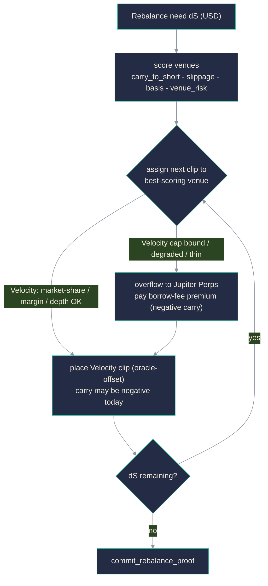

# POYZ Hedge Specification

How POYZ keeps the book delta-neutral: the venue-adapter abstraction, the carry-sign-aware
multi-venue routing, the delta math and rebalancing control, the 3-way carry accounting, and the
concrete on-venue call sequence. This is the specification the `hedge-router` and `delta-keeper`
packages implement.

> Citations resolve to `docs/research-notes.md`; canonical venue/carry decision is `_DIRECTION.md`
> section 8-1. `[ASSUMPTION]` = a chosen parameter (with basis); `[VERIFY]` = an SDK/venue detail to
> confirm; `[BLOCKED]` = cannot verify now (Velocity private beta, offline docs). Proposed numeric
> parameters are starting points to tune against live data, not proven optima.

---

## 1. Venue landscape and the adapter abstraction

The original direction named two order-book hedge venues (both now defunct). Every part of that premise
broke within ~18 months, verified by web research + live API/`npm`/`dig` checks (`research-notes.md`
0-2):

- **The primary venue no longer exists under its original name.** It (formerly Drift) was exploited for ~$285M on 2026-04-01 (durable-nonce
  social engineering of Security Council pre-signatures, Lazarus) and **rebranded to Velocity DEX**
  on 2026-07-01; the former venue's domains resolve to NXDOMAIN. Velocity is USDT-settled,
  perpetuals-only, and in **private beta** (`research-notes.md` 1.1).
- **Zeta (2025-05-01) and Mango v4 (2025-01-13) both shut down.** No order-book perp venue survives
  on Solana besides Velocity (`research-notes.md` 2.1-2.2).
- **The only live secondary is Jupiter Perps**, an LP-pool that charges borrow fee, not funding.

Decision (canonical, `_DIRECTION.md` 8-1): **Velocity primary + Jupiter Perps secondary.** Cross-
package `venue_id` (u8): `0 = velocity`, `1 = jupiter-perps`, `2 = adrena` (reserved), `3 =
flash-trade` (reserved), `255 = unknown`.

| venue | `venue_id` | carry model | role |
|---|---|---|---|
| Velocity (formerly Drift) | 0 | funding-receiving | primary; only potential yield leg -- but **negative carry today** and near-zero liquidity |
| Jupiter Perps | 1 | borrow-fee-paying (~6.14%/yr cost) | secondary; confirmed cost leg, capacity/redundancy only |

**Current carry is negative** (Velocity SOL-PERP: 1y -35.8% APR, 30d -43.3%, 24h -105.3%; only 7d
positive) and **liquidity is effectively absent** (OI ~$7,646, 24h volume ~$8,118,
`research-notes.md` 1.3). So "delta-neutral earns funding" is not true right now; the product is
carry (signed), gated on-chain by `carry_gate` and bounded by hedge capacity (`architecture.md`
8.1, 11.1).

The venue set is unstable by track record, which is exactly why POYZ routes through a **venue-
adapter interface** (not a hard-coded pair) and why **carry direction is a first-class field** --
the two live venues have opposite carry signs.

```rust
// Conceptual adapter surface (implemented in packages/hedge-router, TS).
enum CarryModel { FundingReceiving, BorrowFeePaying }   // first-class: Velocity vs Jupiter differ in SIGN

trait HedgeVenueAdapter {
    fn venue_id(&self) -> u8;                                    // 0 velocity, 1 jupiter-perps, ...
    fn open_short(&self, notional_usd: u64) -> Vec<VenueOrder>;   // openShort
    fn close_short(&self, notional_usd: u64) -> Vec<VenueOrder>;  // closeShort
    fn get_position(&self) -> Position;                          // getPosition: signed base, entry, margin
    fn get_funding_rate(&self) -> SignedRate;                    // getFundingRate: raw hourly venue rate
    fn get_depth(&self, notional_usd: u64) -> Depth;             // getDepth: slippage / pool capacity
    fn get_margin(&self) -> MarginHealth;                        // getMargin: maint. margin, liq/utilization
    fn carry_model(&self) -> CarryModel;                         // carryModel: how to read the sign
}
```

Router normalisation -- one signed "hourly carry to a short holder":

```
carry_to_short(v) = if carry_model(v) == FundingReceiving  then  +funding_rate(v)   // Velocity: >0 when longs pay shorts
                    if carry_model(v) == BorrowFeePaying    then  -borrow_fee(v)     // Jupiter: always < 0 (short pays)
```

`VenueId` is an extensible string+constant, never a closed union: three venues died/broke in 18
months, so swapping one must be a config change, not a redeploy (`_DIRECTION.md` 8-1).

---

## 2. Delta definition and measurement

All values in USD via the gated Pyth oracle price `p = price * 10^expo` (`research-notes.md` 3;
`architecture.md` 6). Integer/bps math only on-chain.

```
C = collateral notional (USD) = collateral_amount * p
H = hedge notional (USD)      = sum over venues v of |short_base_v| * p
d = net delta (bps)           = (C - H) * 10000 / C        (signed; long-heavy > 0)
```

Target `d = 0`. The measurement of record is the on-chain recompute in `commit_rebalance_proof`
(`architecture.md` 7); the keeper's continuous measurement is advisory (decides *when* to act).
Because both legs are linear, delta is just the notional imbalance -- no convexity to chase -- so a
notional band, not a convexity model, is the right control (`research-notes.md` 6). Residuals are
execution basis and LST-vs-index tracking (section 7).

---

## 3. Rebalancing control: two-band hysteresis

Threshold rebalancing with hysteresis captures most of the neutrality benefit at a fraction of the
trade count and prevents flapping (`research-notes.md` 6). Three bands:

| band | symbol | proposed | action |
|---|---|---|---|
| exit / target | `delta_exit_bps` | `[ASSUMPTION]` 25 bps | rebalance pulls `|d|` to this, not to 0 |
| trigger | `delta_band_bps` | `[ASSUMPTION]` 100 bps | crossing arms a rebalance |
| hard | `delta_hard_bps` | `[ASSUMPTION]` 300 bps | emergency rebalance + pause `mint` |

```
every tick (keeper):
    d = measure_delta_bps()
    if |d| >= delta_hard_bps: emergency_rebalance(0); poyz_core.pause_mint()
    elif |d| >= delta_band_bps: rebalance(target = sign(d) * delta_exit_bps)   # into inner band
    # else inside band -> do nothing (hysteresis dead-zone)
    if now - last_proof_time >= max_epoch_secs: rebalance_if_needed(); commit_rebalance_proof()
```

- **Hysteresis dead-zone** between exit and trigger bands is the anti-flapping guarantee.
- **Time backstop** (`max_epoch_secs`, `[ASSUMPTION]` 3600s, Velocity funding is hourly): even a
  balanced book commits a proof each hour to settle carry into the reward index and publish a fresh
  `delta_bps` datapoint.
- Rebalance to the inner band, not 0, to skip the most expensive last increment of precision.
- `[OPEN]` calibrate bands against SOL vol + Velocity depth (`research-notes.md` 5); the values are
  starting points. Note Velocity's near-zero depth means even small rebalances may exhaust the book
  and spill to Jupiter (section 4).

---

## 4. Multi-venue routing algorithm (carry-sign-aware)

The objective is not "spread the hedge evenly." A naive even split would put half the notional on
Jupiter, where a short *pays* borrow fee, and convert the (already negative) carry into a worse
loss. The router is built around one asymmetry: **Velocity carry can be positive (yield) or
negative; Jupiter carry is always negative (cost)** (section 1). Velocity holds the hedge until a
constraint forces overflow; Jupiter is paid-for insurance.

**Per-venue marginal score** for adding short notional `x` to venue `v` (hourly rate on `x`):

```
score_v(x) = carry_to_short(v)    # signed; +funding (Velocity) or -borrow_fee (Jupiter)
           - slippage_v(x)        # exec cost vs oracle (Velocity book depth; Jupiter pool capacity)
           - basis_penalty_v      # persistent mark-vs-oracle basis (both ~small: oracle agreement ~1bp, research-notes 3)
           - venue_risk_penalty_v # rises with POYZ's share of v's market and v's health (4.1)
```

### 4.1 Constraints (note the reframed concentration cap)
- **Venue-market concentration cap** (the important one): limit POYZ's short as a fraction of the
  *venue's own* SOL-PERP market -- `short_v / venue_market_size_v <= max_venue_market_share_bps`
  (`[ASSUMPTION]` 1500 bps). This caps how large POYZ is *inside* a venue (bounding exit slippage and
  POYZ's share of that venue's socialized-loss / ADL / pool-drawdown, `risk-spec.md` 2), **not** the
  share of POYZ's hedge on one venue -- POYZ *wants* ~100% on Velocity for yield.
  **Reality check at current depth:** Velocity SOL-PERP OI is ~$7,646 (`research-notes.md` 1.3), so a
  15% share cap lets the Velocity leg hold only ~**$1,147** of hedge. At that level the "primary,
  funding-receiving" venue can hedge almost nothing; essentially all real hedge notional must
  overflow to Jupiter (paying borrow) or the protocol's supply must stay in the low thousands of
  dollars. This is not a tuning nuance -- it is the binding constraint on the whole product until
  Velocity's liquidity recovers post-relaunch, and it is why the capacity cap (`architecture.md` 9.2)
  keeps supply tiny during private beta. `1500 bps` is a starting `[ASSUMPTION]`; the real limit is
  set by measured depth, not by the percentage.
  **Do not sum the two venues into one headroom number.** The live backend reports
  `venue_capacity_usd ~= $10.0M`, but ~$10M of that is **Jupiter's JLP pool liquidity** (borrow-*cost*
  capacity, `carry_model = BorrowFeePaying`) and only ~$7,680 is Velocity's funding-*yield* capacity;
  the API's `basis` field flags that "OI and pool liquidity are different quantities" (`research-notes.md`
  1.3). Reading the $10M aggregate as hedge headroom is a category error -- it makes the yield leg look
  ~4 orders of magnitude larger than it is. The router uses the aggregate only for *can-we-hedge-at-all*
  capacity; carry (4.2) counts the Jupiter portion as pure cost.
- Depth / pool-capacity cap per clip; larger moves split into child clips (section 5). Jupiter is
  oracle-priced but bounded by JLP short capacity (`research-notes.md` 2.3).
- Margin safety: keep each venue subaccount at/below target utilisation (<= 50%), buffering
  liquidation (`risk-spec.md` 3).

### 4.2 Jupiter as an insurance premium, and the break-even
If a fraction `w` of the hedge sits on Jupiter (hourly borrow `b_j > 0`) and `1 - w` on Velocity
(hourly funding `f_d`, signed), blended protocol carry is:

```
carry_blended = (1 - w) * f_d  -  w * b_j
```

Yield-positive only while `f_d >= w * b_j / (1 - w)`. Since `f_d` is negative today, `carry_blended`
is negative for any `w`, and larger `w` (forced by Velocity's thin depth) makes it worse -- feeding
`carry_gate` and the negative-carry playbook (`architecture.md` 8.1; `risk-spec.md` 1.5). Overflow
to Jupiter is still correct at negative blended carry when the alternative is breaching the delta
mandate: a bounded, known borrow cost dominates unbounded directional risk on an un-hedgeable slice.
For a synthetic dollar, "do not hedge" is never an option below the `delta_hard_bps` breaker.



Design intent: the hedge sits on Velocity while its (tiny) capacity allows; Jupiter carries the
overflow at a disclosed borrow cost tracked in `net_carry` (section 6). Given today's regime, most
routed notional is a cost either way -- which is why `carry_gate` blocks new mint rather than
pretending the hedge is free.

---

## 5. On-venue call sequence (Velocity, `[VERIFY]` against the new SDK)

Velocity ships `@velocity-exchange/sdk` 0.13.0 whose client is **`VelocityClient`** (the old
client-class symbol does not exist in 0.13.0). The method shapes below mirror the pre-rebrand
(formerly Drift) v2 surface, but because the SDK is new and Velocity is in private beta with offline
docs, **every
call is `[VERIFY]`/`[BLOCKED]`** until confirmed against 0.13.0 -- do not assume the pre-rebrand method names
carried over unchanged.

```ts
// [CRITICAL] @velocity-exchange/sdk aliases @coral-xyz/anchor to npm:@anchor-lang/core@1.0.1,
// which collides with the real Anchor 0.31 in packages/anchor-program. Integrate via
// peerDependenciesMeta optional + dynamic import + a narrow structural interface, never a plain
// dependency (research-notes.md 1.2).
const velocity = await import('@velocity-exchange/sdk');           // dynamic import (isolation)
const client = new velocity.VelocityClient({
  connection, wallet: keeperWallet, env: 'mainnet-beta',
  authority: HEDGE_AUTHORITY_PDA,        // program PDA owns the subaccount (Path A); or CPI (Path B)
});                                       // [VERIFY] constructor shape in 0.13.0
await client.subscribe();

const market   = client.getPerpMarketAccount(0);                  // [VERIFY] SOL-PERP index 0
const funding  = client.getFundingRate(0);                        // [VERIFY] method name in 0.13.0
const position = client.getUser().getPerpPosition(0);             // [VERIFY] signed baseAssetAmount

const targetShortBase = collateralNotionalUsd / oraclePrice;
const deltaBase = targetShortBase - Math.abs(position.baseAssetAmount);
if (needRebalance) {
  const clip = clampToDepth(deltaBase, market);                   // Velocity depth is tiny (research-notes 1.3)
  await client.placePerpOrder({                                   // [VERIFY] OrderParams shape / name
    orderType: 'ORACLE', marketIndex: 0,
    direction: deltaBase > 0 ? 'SHORT' : 'LONG',
    baseAssetAmount: client.convertToPerpPrecision(Math.abs(clip)),
    oraclePriceOffset: offsetTicks,
  });
}
await poyzCore.methods.commitRebalanceProof(/* sequence, venues_hash, venue_id=0, delta_before, delta_after, hedged_notional, collateral_notional */)
  .accounts({ ...proofAccounts }).rpc();   // re-verifies delta on-chain (architecture.md 8)
```

Notes:
- `venue_id = 0` for Velocity, `1` for Jupiter, recorded in every proof (`architecture.md` 7).
- **Path A vs Path B** (`architecture.md` 4): if Velocity retained the former venue's no-withdraw delegate, the
  keeper places orders directly under delegation; if not (`[BLOCKED]`), a `poyz-core` CPI places the
  order with program-enforced bounds. The call sequence above is Path A; Path B moves the
  `placePerpOrder` inside a `poyz-core` instruction.
- Second venue (Jupiter Perps) implements the same adapter against the JLP **LP-pool**, not an order
  book: positions are oracle-priced (no order-type/offset), `carry_model = BorrowFeePaying`, and
  `get_funding_rate` is reported as the negative hourly borrow fee. API confirmed live at
  `https://perps-api.jup.ag/v1` (docs at `/v1/docs`). `[VERIFY]` per-token borrow schedule + JLP
  short capacity (`research-notes.md` 2.3).
- Zeta and Mango v4 are excluded (both discontinued, `research-notes.md` 2.1-2.2).

---

## 6. Carry accounting (3-way split) and staked distribution

Carry settles in the venue quote asset (**USDT** on Velocity), i.e. a change in the subaccount's
quote balance, commingling funding + fees + realized basis (`research-notes.md` 1.3). The adopted
schema (`_DIRECTION.md` 8-1) splits it three ways so the sign and the cost are both visible:

```
gross_funding(epoch) = funding received/paid on the Velocity leg          (signed; negative today)
hedge_cost(epoch)    = Jupiter borrow paid + venue fees + realized basis  (>= 0)
net_carry(epoch)     = gross_funding - hedge_cost                         (what stakers actually get)
```

`net_carry` is measured as the quote-balance change across venue subaccounts net of program-
initiated margin moves, then attributed into the three lines. The header metric shows **net carry
with its sign** (negative shown as-is), never "funding APY" (`_DIRECTION.md` 8-1). The reward index
advances by `net_carry / total_staked`; when negative, the buffer covers first (`risk-spec.md`), and
only the residual reduces the index.

**Velocity asymmetric funding cap (must be modeled or yield is overstated).** Velocity's AMM pays
asymmetric funding only up to **1/3 of its held equity per period** (Capped Symmetric Funding,
`research-notes.md` 1.3). So even in a positive regime, `gross_funding` received is **capped below
the headline funding rate**. The simulator (`/api/simulate`, Rigging Board) and the reward index
must apply this cap; ignoring it overstates yield and violates the honesty requirement.

**Distribution:** standard accumulator; only staked $POYZ takes carry exposure (holding $POYZ is
holding a dollar). Because carry is negative today, staked NAV can decline after the buffer -- the
7-day unstake cooldown (Ethena sUSDe parallel) gives the keeper time to unwind against outflow.
Claimed via `claim_funding`.

**Later refinement (`[OPEN]`):** finer disaggregation of funding vs fees vs basis if Velocity's
per-position settled-funding field is exposed (`[VERIFY]` in 0.13.0); until then the 3-way split
above is the truthful decomposition.

---

## 7. Basis and LST tracking risk (residuals after neutrality)

1. **Execution basis:** the short opens at a venue mark that can differ from POYZ's Pyth value.
   Measured cross-venue agreement was ~1 bp (Pyth $76.285 / Velocity $76.293 / Jupiter $76.294,
   `research-notes.md` 3), so basis is small in calm conditions; oracle-offset orders and the
   `basis_penalty_v` term minimise it but it cannot be zero.
2. **Collateral-vs-index tracking:** if collateral is an LST, its price can diverge from the SOL
   index the perp tracks (de-peg, slashing); then the legs move on different underlyings and the
   hedge silently breaks -- the on-chain analog of Ethena's slashing risk (`research-notes.md` 4).
   Mitigations: value collateral by its *own* Pyth feed, size the hedge to the LST's SOL-equivalent
   exposure, cap LST collateral share. First-class in `risk-spec.md`, not a footnote.

---

## Sources

Resolved in `docs/research-notes.md`; canonical decision `_DIRECTION.md` 8-1. The former venue's doc
domains are dead (NXDOMAIN post-rebrand) and intentionally not used. Primary live links:
[Chainalysis - Drift hack](https://www.chainalysis.com/blog/lessons-from-the-drift-hack/) ·
[npm @velocity-exchange/sdk](https://www.npmjs.com/package/@velocity-exchange/sdk) ·
[Jupiter Perps how-it-works](https://station.jup.ag/labs/perpetual-exchange/how-it-works) ·
[Jupiter Perps API](https://perps-api.jup.ag/v1/docs) ·
[delta-neutral bands (LuxAlgo)](https://www.luxalgo.com/blog/how-delta-hedging-automation-works/).
